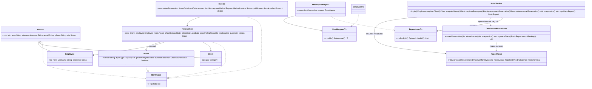

# Diagrama de clases — HotelReservas

El modelo Java representa datos y resultados. Las reglas de negocio y las operaciones de escritura están centralizadas en Oracle.

```mermaid
classDiagram
    direction TB

    class Identifiable { <<interface>> +getId() int }
    class Person { <<abstract>> -id int -name String -documentNumber String -email String -phone String -city String }
    class Client { -category Category }
    class Employee { -role Role -username String -password String }
    class Room { -number String -type Type -capacity int -pricePerNight double -available boolean -underMaintenance boolean }
    class Reservation { -client Client -employee Employee -room Room -checkIn LocalDate -checkOut LocalDate -pricePerNight double -total double -guests int -status Status }
    class Invoice { -reservation Reservation -issueDate LocalDate -amount double -paymentMethod PaymentMethod -status Status -paidAmount double -refundAmount double }

    Person ..|> Identifiable
    Room ..|> Identifiable
    Reservation ..|> Identifiable
    Invoice ..|> Identifiable
    Person <|-- Client
    Person <|-- Employee
    Reservation --> Client
    Reservation --> Employee : opcional
    Reservation --> Room
    Invoice --> Reservation

    class HotelService { +login() Employee +registerClient() Client +registerGuest() Client +registerEmployee() Employee +createReservation() Reservation +cancelReservation() void +payInvoice() void +getBasicReport() BasicReport }
    class OracleHotelProcedures { +createReservation() int +issueInvoice() int +payInvoice() void +generalStats() BasicReport +roomRanking() List }
    class Repository~T~ { <<interface>> +findById() Optional +findAll() List }
    class JdbcRepository~T~ { -connection Connection -mapper RowMapper }
    class RowMapper~T~ { <<interface>> +table() String +read() T }
    class SqlMappers
    class ReportRows { <<records>> BasicReport ReservationsByStatus MonthlyIncome RoomUsage TopClient PendingBalance RoomRanking }

    HotelService --> Repository : consulta
    HotelService --> OracleHotelProcedures : operaciones de negocio
    HotelService --> ReportRows : devuelve resultados
    JdbcRepository ..|> Repository
    JdbcRepository --> RowMapper
    SqlMappers ..> RowMapper
    OracleHotelProcedures ..> ReportRows : mapea cursores
```
