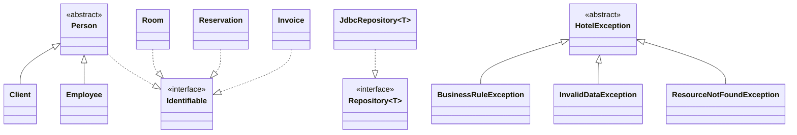

# Diagrama de jerarquías — HotelReservas

```mermaid
classDiagram
    direction TB
    class Identifiable { <<interface>> }
    class Person { <<abstract>> }
    class Client
    class Employee
    Person <|-- Client
    Person <|-- Employee
    Person ..|> Identifiable

    class Room
    class Reservation
    class Invoice
    Room ..|> Identifiable
    Reservation ..|> Identifiable
    Invoice ..|> Identifiable

    class Repository~T~ { <<interface>> }
    class JdbcRepository~T~
    JdbcRepository ..|> Repository

    class HotelException { <<abstract>> }
    class BusinessRuleException
    class InvalidDataException
    class ResourceNotFoundException
    HotelException <|-- BusinessRuleException
    HotelException <|-- InvalidDataException
    HotelException <|-- ResourceNotFoundException
```
